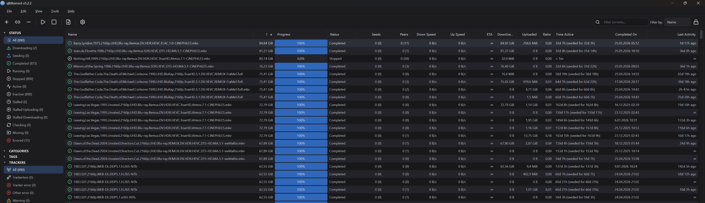
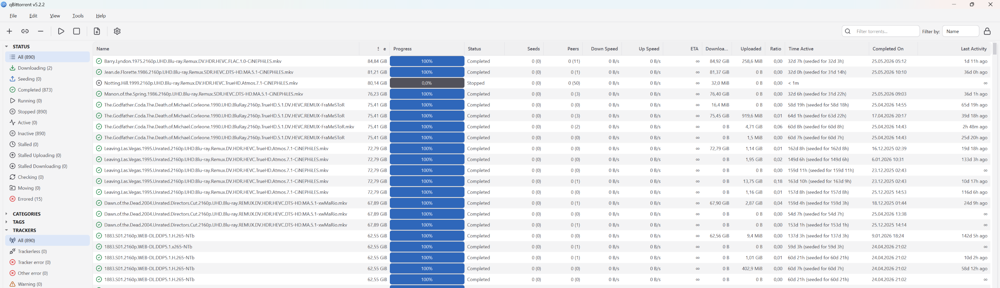

# qBittorrent Fusion theme

A modern, flat theme for qBittorrent with dark and light variants. Neutral
surfaces, a single blue accent, and clean outline icons.

## Preview

### Dark

### Light

## Requirements

- qBittorrent 4.4 or newer (Qt 6)
- The Fusion style, set in qBittorrent's options (see below). It is required for
  the progress bar percentage to render correctly.

## Install

Two forms are available. Both end the same way: pick the theme, set the Fusion
style, restart.

### Single file (.qbtheme)

1. Download `qbittorrent-fusion-dark.qbtheme` or `qbittorrent-fusion-light.qbtheme`
   from the [Releases page](https://github.com/Anil-Akdeniz/qbittorrent-fusion-theme/releases).
2. qBittorrent: Tools > Options > Behaviour > Interface
3. Use custom UI theme, then select the downloaded `.qbtheme`.
4. Set Style to Fusion.
5. Restart qBittorrent.

### Folder

1. Clone or download this repository.
2. Tools > Options > Behaviour > Interface > Use custom UI theme, then select
   `themes/dark/config.json` (or `themes/light/config.json`).
3. Set Style to Fusion.
4. Restart qBittorrent.

## Variants

- dark: neutral dark surfaces, blue accent.
- light: white surfaces, blue accent.

## Customize

Each variant lives in `themes/<name>/`:

- `config.json`: palette plus transfer-list, log, and RSS colors.
- `stylesheet.qss`: widget styling. Control images are referenced as
  `:/uitheme/...`, which qBittorrent resolves to the theme's own folder.
- `icons/`, `controls/`: SVG assets.

The release `.qbtheme` files are built automatically by GitHub Actions. To build
them locally you need Qt's `rcc` (Qt 6) on your PATH, then run `./gen.sh`.

## Credits

Icons are from [Lucide](https://lucide.dev) (ISC). The tray and RSS icons come
from qBittorrent's fluent theme (MIT). See [NOTICE](NOTICE) for details.

## License

[MIT](LICENSE)
